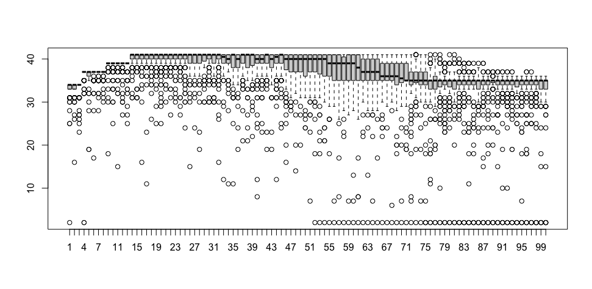
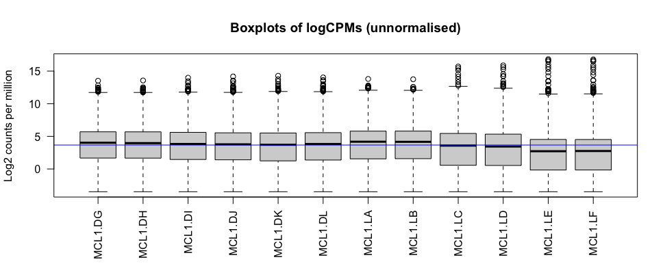
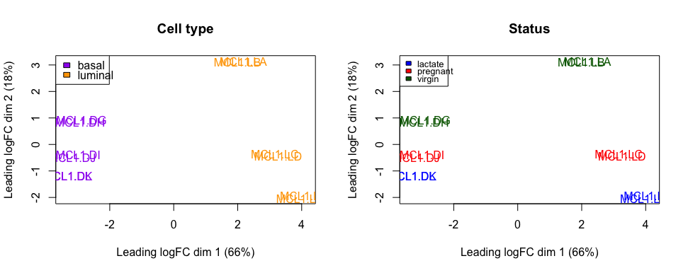
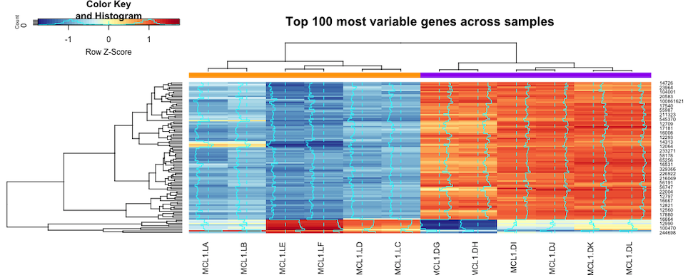
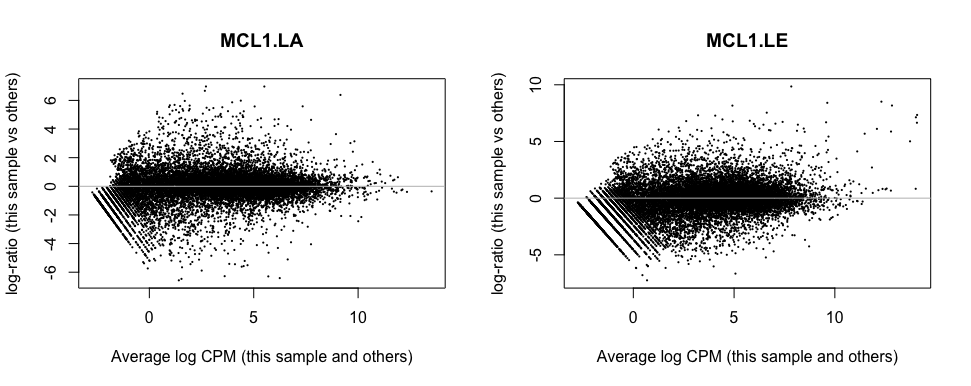
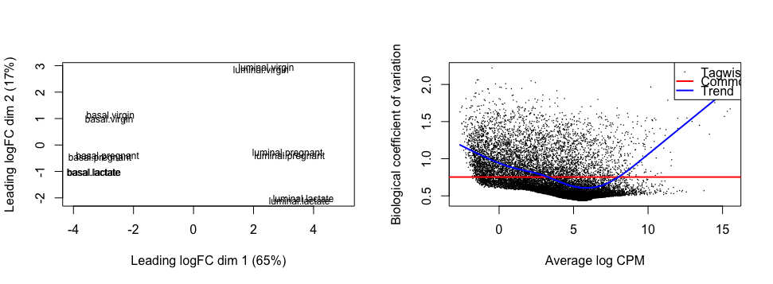
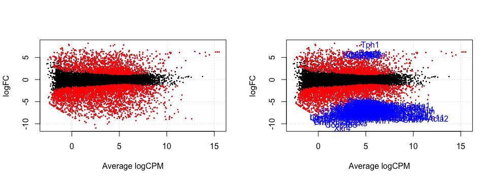
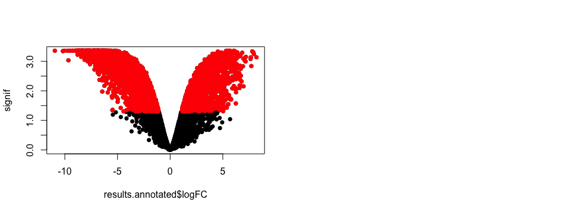

# Bulk RNA-sequencing analysis of murine mammary tissue

RNA-sequencing analysis of murine mammary tissue using R and Bioconductor packages including baseq, Rsubread and edgeR. 

These data and code were derived from [Lun, Chen & Smyth 2016](https://pubmed.ncbi.nlm.nih.gov/27008025/) and a [COMBINE training and educational workshop](https://bioinformatics-core-shared-training.github.io/RNAseq-R/). 

Original authors: Maria Doyle, Belinda Phipson, Matt Ritchie, Anna Trigos, Harriet Dashnow, Charity Law.


## Preface

RNA-sequencing technologies have had a profound impact on many facets of modern medical research, providing valuable insights into the intricacies of gene expression, functional genomics and molecular mechanisms behind various dieases.

RNA-sequencing provides a comprehensive and high-resolution view of the transcriptome, but requires careful experimental design and thorough analytical workflows, the latter made possible by a suite of R packages and libraries.

The purpose of this project is to hone my RNA-sequencing skills using R and relevant Bioconductor packages and libraries. 

Please note that these learning materials were derived from a COMBINE RNA-sequencing workshop delivered on May 11-12th 2016 in Melbourne, Australia. 

## Table of Contents

- [General info](#general-info)
- [Technologies](#technologies)
- [Screenshots](#screenshots)
- [Code example](#code-example)
- [Repository structure](#repository-structure)
- [References](#references)

## General info

### 1_alignment_and_counting.Rmd

1. Loads `baseq` and `Rsubread` packages.
2. Creates R data frame from `FASTQ` file using`baseq` for exploratory data analysis.
3. Loads all `FASTQ` files.
4. Builds Mouse Chromosome 1 Index using `Rsubread`.
5. Aligns reads to index using `Rsubread`
6. Uses `propmapped` function of `Rsubread` to generate summary/proportion of reads mapped to reference genome.
7. Performs some Quality Control by checking Phred scores  using `qualityScores` function. Creates boxplot of scores:
8. Counts reads mapped to genes using `featureCounts` function.
9. Creates R data frames of gene counts for exploratory data analysis.

### 2_preprocessing_and_quality_control.Rmd

1. Loads `edgeR`, `limma`, `Glimma`, `gplots`, `org.Mm.eg.db` and `RColorBrewer`.
2. Imports `sampleinfo` and reads in `countdata` (prepared previously).
3. Formats `countdata` to ensure columns match SampleName column in `sampleinfo`.
4. Filter out lowly expressed genes using counts per million (`cpm` function). 
5. Converts counts to `DGEList` object (`edgeR` object used to store count data).
6. Checks number of reads in each sample and plots data as boxplot:
   
7. Plots MDSplot to visualise principle component analysis (PCA; determines greatest sources of variation in data by clustering similar data):
   
8. Performs Hierarchical Clustering using `heatmap.2` function from `gplots` to visualise top 100 most differentially expressed (DE) genes:
   
9. Normalises composition biases between libraries using trimmed mean of M-values normalisation method (TMM):
   
10. Data objects saved for further analysis.


### 3_differential_expression_using_edgeR.Rmd

1. Creates design matrix (displays how conditions or groups are modelled in the statistical analysis).

2. Replots MDSplot with `CellType` and `Status` info and plots Estimated Dispersion:
   

3. Tests for DE using genewise Generalised Linear Model (GLM).
4. Conducts likelihood ratio tests for luminal vs basal cell types.
5. Creates Contrast Matrix in order to find DE genes between pregnant and virgin status mice.
6. Saves data object for visualisation.

### 4_annotation_and_visualisation.Rmd

1. Creates Results data frame containing all `ENTREZID`, which allows annotation using `org.Mm.eg.db` library.

2. Creates PlotSmear that visualises DE genes and the average logCPM:
   

3. Creates Volcano plot that displays measure of signficance (`y-axis`) and fold-change (`x-axis`):
   

### 5_gene-set_testing.Rmd

1. pending

## Technologies

Project created and run using:

- R 4.3.2
  - BiocManager 1.30.22
    - baseq 0.1.4
    - Rsubread 2.16.1
    - edgeR 4.0.15
    - limma 3.58.1
    - Glimma 2.12.0
    - gplots 3.1.3.1
    - org.Mm.eg.db 3.18.0
    - RColorBrewer 1.1-3

- RStudio 2023.09.1+494


## Screenshots

**pending**

## Code example

````R
## Code Snippet from 1_preprocessing_and_quality_control.Rmd
#################################################

```{r MDSplot}
# Create MDSplot
plotMDS(dgeObj)

# Plot two plots side-by-side
par(mfrow=c(1,2))

# ===== CELL TYPE ===== 

# Set colour schemes for CellType (see sampleinfo)
sampleinfo$CellType
levels(sampleinfo$CellType)

# Check class of CellType (note that it must be `factor`, not `character`)
class(sampleinfo$CellType)

# Convert to `factor` using factor function
sampleinfo$CellType <- factor(sampleinfo$CellType)

## Set purple for basal and orange for luminal
col.cell <- c("purple","orange")[sampleinfo$CellType]
data.frame(sampleinfo$CellType,col.cell)

# Redo MDS with cell type colouring
plotMDS(dgeObj,col=col.cell)
# Add legend to plot to designate colours to cell type
legend("topleft",fill=c("purple","orange"),legend=levels(sampleinfo$CellType))
# Add title
title("Cell type")

# ======= STATUS ======= 

# Similarly for Status
levels(sampleinfo$Status)

# # Check class of Status (note that it must be `factor`, not `character`)
class(sampleinfo$Status)

# Convert to Status to `factor` using factor function
sampleinfo$Status <- factor(sampleinfo$Status) 

# Set blue for lactate, red for pregnant and darkgreen for virgin
col.status <- c("blue","red","darkgreen")[sampleinfo$Status]
data.frame(sampleinfo$Status,col.status)

# Plot MDS with status type colouring
plotMDS(dgeObj,col=col.status)
# Add legend to plot to designate colours to status
legend("topleft",fill=c("blue","red","dark green"),legend=levels(sampleinfo$Status),cex=0.8)
# Add title
title("Status")

# ======= CORRECTION =======
# From the plot, it is clear that sample MCL1.DG is in fact a basal cell, and MCL1.LA is a luminal cell

# Current (incorrect) sampleinfo
sampleinfo

# Corrected sampleinfo (MCL1.DG = basal, MCL1.LA = luminal)
sampleinfo <- read.delim("data/3219685/SampleInfo_Corrected.txt")
sampleinfo

# MDSplot with corrected information
par(mfrow=c(1,2))

# Convert to `factor` using factor function
sampleinfo$CellType <- factor(sampleinfo$CellType)
## CellType: Set purple for basal and orange for luminal
col.cell <- c("purple","orange")[sampleinfo$CellType]

# Convert to Status to `factor` using factor function
sampleinfo$Status <- factor(sampleinfo$Status) 
# Status: Set blue for lactate, red for pregnant and darkgreen for virgin
col.status <- c("blue","red","darkgreen")[sampleinfo$Status]


# Plot CellType
plotMDS(dgeObj,col=col.cell)
legend("topleft",fill=c("purple","orange"),legend=levels(sampleinfo$CellType))
title("Cell type")

# Plot Status
plotMDS(dgeObj,col=col.status)
legend("topleft",fill=c("blue","red","darkgreen"),legend=levels(sampleinfo$Status),cex=0.8)
title("Status")

# Plots Dimension 3 (appears to separate pregnant samples from the rest)
plotMDS(dgeObj,dim=c(3,4), col=col.status)
legend("topleft",fill=c("blue","red","darkgreen"),legend=levels(sampleinfo$Status),cex=0.8)
title("Status")

# ======= MDSplots using Glimma (interactive plots) =======

# Create Label for interactive plot table containing SampleName, CellType and Status
labels <- paste(sampleinfo$SampleName, sampleinfo$CellType, sampleinfo$Status)
# Create Groups based on CellType and Status
group <- paste(sampleinfo$CellType,sampleinfo$Status,sep=".")
# Convert `group` object to factor (so that it can be plotted and coloured)
group <- factor(group)
# Create interactive Glimma HTML plots
glMDSPlot(dgeObj, labels=labels, groups=group, folder="mds")
```
````

## Repository structure

```
.
└── rna-seq-analysis-murine-mammary
    ├── 1_preprocessing_and_quality_control.Rmd
    ├── 2_differential_expression_using_edgeR.Rmd
    ├── 3_annotation_and_visualisation.Rmd
    ├── B.PregVsLacResults.csv
    ├── README.md
    ├── Robjects
    │   ├── DE.Rdata
    │   └── preprocessing.Rdata
    ├── chr1_mm10.files
    ├── chr1_mm10.log
    ├── chr1_mm10.reads
    ├── data
    │   ├── 3219685
    │   │   ├── GSE60450_Lactation-GenewiseCounts.txt
    │   │   ├── ResultsTable_small.txt
    │   │   ├── SampleInfo.txt
    │   │   ├── SampleInfo_Corrected.txt
    │   │   ├── mouse_H_v5.rdata
    │   │   ├── mouse_c2_v5.rdata
    │   │   └── small_counts.txt
    │   ├── SRR1552444.fastq.gz
    │   ├── SRR1552444.fastq.gz.subread.BAM
    │   ├── SRR1552444.fastq.gz.subread.BAM.indel.vcf
    │   ├── SRR1552444.fastq.gz.subread.BAM.summary
    │   ├── SRR1552445.fastq.gz
    │   ├── SRR1552445.fastq.gz.subread.BAM
    │   ├── SRR1552445.fastq.gz.subread.BAM.indel.vcf
    │   ├── SRR1552445.fastq.gz.subread.BAM.summary
    │   ├── SRR1552446.fastq.gz
    │   ├── SRR1552446.fastq.gz.subread.BAM
    │   ├── SRR1552446.fastq.gz.subread.BAM.indel.vcf
    │   ├── SRR1552446.fastq.gz.subread.BAM.summary
    │   ├── SRR1552447.fastq.gz
    │   ├── SRR1552447.fastq.gz.subread.BAM
    │   ├── SRR1552447.fastq.gz.subread.BAM.indel.vcf
    │   ├── SRR1552447.fastq.gz.subread.BAM.summary
    │   ├── SRR1552448.fastq.gz
    │   ├── SRR1552448.fastq.gz.subread.BAM
    │   ├── SRR1552448.fastq.gz.subread.BAM.indel.vcf
    │   ├── SRR1552448.fastq.gz.subread.BAM.summary
    │   ├── SRR1552449.fastq.gz
    │   ├── SRR1552449.fastq.gz.subread.BAM
    │   ├── SRR1552449.fastq.gz.subread.BAM.indel.vcf
    │   ├── SRR1552449.fastq.gz.subread.BAM.summary
    │   ├── SRR1552450.fastq.gz
    │   ├── SRR1552450.fastq.gz.subread.BAM
    │   ├── SRR1552450.fastq.gz.subread.BAM.indel.vcf
    │   ├── SRR1552450.fastq.gz.subread.BAM.summary
    │   ├── SRR1552451.fastq.gz
    │   ├── SRR1552451.fastq.gz.subread.BAM
    │   ├── SRR1552451.fastq.gz.subread.BAM.indel.vcf
    │   ├── SRR1552451.fastq.gz.subread.BAM.summary
    │   ├── SRR1552452.fastq.gz
    │   ├── SRR1552452.fastq.gz.subread.BAM
    │   ├── SRR1552452.fastq.gz.subread.BAM.indel.vcf
    │   ├── SRR1552452.fastq.gz.subread.BAM.summary
    │   ├── SRR1552453.fastq.gz
    │   ├── SRR1552453.fastq.gz.subread.BAM
    │   ├── SRR1552453.fastq.gz.subread.BAM.indel.vcf
    │   ├── SRR1552453.fastq.gz.subread.BAM.summary
    │   ├── SRR1552454.fastq.gz
    │   ├── SRR1552454.fastq.gz.subread.BAM
    │   ├── SRR1552454.fastq.gz.subread.BAM.indel.vcf
    │   ├── SRR1552454.fastq.gz.subread.BAM.summary
    │   ├── SRR1552455.fastq.gz
    │   ├── SRR1552455.fastq.gz.subread.BAM
    │   ├── SRR1552455.fastq.gz.subread.BAM.indel.vcf
    │   ├── SRR1552455.fastq.gz.subread.BAM.summary
    │   ├── chr1.fa
    │   ├── chr1_mm10.00.b.array
    │   ├── chr1_mm10.00.b.tab
    │   ├── chr1_mm10.files
    │   ├── chr1_mm10.reads
    │   └── targets2.txt
    ├── images
    │   ├── banner.afdesign
    │   └── banner.png
    ├── mds
    │   ├── MDS-Plot.html
    │   ├── css
    │   │   ├── glimma.min.css
    │   │   └── src
    │   │       └── images
    │   │           ├── animated-overlay.gif
    │   │           ├── favicon.ico
    │   │           ├── sort_asc.png
    │   │           ├── sort_asc_disabled.png
    │   │           ├── sort_both.png
    │   │           ├── sort_desc.png
    │   │           ├── sort_desc_disabled.png
    │   │           ├── ui-bg_flat_0_aaaaaa_40x100.png
    │   │           ├── ui-bg_flat_75_ffffff_40x100.png
    │   │           ├── ui-bg_glass_55_fbf9ee_1x400.png
    │   │           ├── ui-bg_glass_65_ffffff_1x400.png
    │   │           ├── ui-bg_glass_75_dadada_1x400.png
    │   │           ├── ui-bg_glass_75_e6e6e6_1x400.png
    │   │           ├── ui-bg_glass_95_fef1ec_1x400.png
    │   │           ├── ui-bg_highlight-soft_75_cccccc_1x100.png
    │   │           ├── ui-icons_222222_256x240.png
    │   │           ├── ui-icons_2e83ff_256x240.png
    │   │           ├── ui-icons_454545_256x240.png
    │   │           ├── ui-icons_888888_256x240.png
    │   │           └── ui-icons_cd0a0a_256x240.png
    │   └── js
    │       ├── MDS-Plot.js
    │       └── glimma.min.js
    ├── plots
    │   ├── BCV_plots_(dispersion_estimates).png
    │   ├── High_var_genes.heatmap.png
    │   ├── Rplot.png
    │   ├── Rplot01.png
    │   ├── cell_type_&_status_coloured.png
    │   ├── celltype_&_status_coloured_corrected.png
    │   ├── heatmap_clustering.png
    │   ├── mean_difference_normalised.png
    │   ├── mean_difference_scatterplot.png
    │   ├── plotsmear.png
    │   ├── plotsmear_with_labels.png
    │   ├── status_colours_dim3.png
    │   └── volcano_plot.png
    └── subread-index-sam-032470-PKW7uo
```

## References

- Materials based on:
  - Lun AT, Chen Y, Smyth GK. [It's DE-licious: A Recipe for Differential Expression Analyses of RNA-seq Experiments Using Quasi-Likelihood Methods in edgeR.](https://pubmed.ncbi.nlm.nih.gov/27008025/) Methods Mol Biol. 2016;1418:391-416. doi: 10.1007/978-1-4939-3578-9_19. PMID: 27008025.

- Workshop delivered by Combine Australia:
  - [Combine training and educational RNA-seq workshop](https://bioinformatics-core-shared-training.github.io/RNAseq-R/)
  - Original authors: Maria Doyle, Belinda Phipson, Matt Ritchie, Anna Trigos, Harriet Dashnow, Charity Law.

Adapted by Samuel Palframan - February 2024.